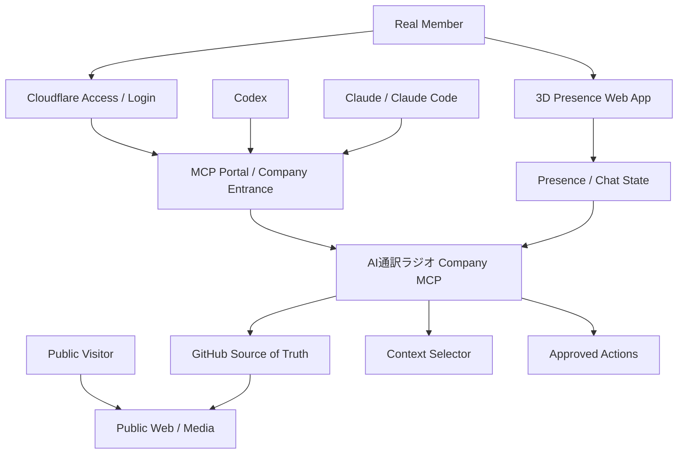
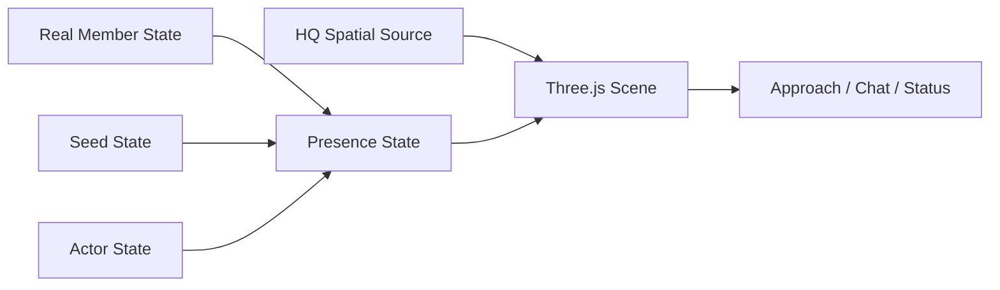

# AI通訳ラジオ｜System Architecture v0.1

Status: Draft for review / 2026-10-01  
Audience: Codex / Claude / implementation reviewers

## 1. Purpose

AI通訳ラジオのSource of TruthをGitHubに維持したまま、Cloudflareを入口として、異なるAIクライアントと現実の人間が同じ組織情報・ツール・権限を共有できるようにする。

3D Presenceは実行基盤とは分離し、同じ組織状態を人間が直感的に感じるための表示・コミュニケーション層として扱う。

## 2. Core principles

1. **GitHub remains Source of Truth.**
2. **Cloudflare is the entrance, not the brain.**
3. **MCP is the shared company interface.**
4. **Codex / Claude are interchangeable clients where possible.**
5. **Presence is optional UI; work must not depend on 3D being open.**
6. **Public / internal / secret information remain separated.**
7. **Direct main writes are not the default. Work flows through branch / PR / human review.**
8. **Unknown stays Unknown until a human or source resolves it.**

## 3. Logical architecture



## 4. Current vs planned

### Current

- GitHub repository exists and is the Source of Truth.
- README / CURRENT / DECISIONS / AGENTS are present.
- Public / behind-the-scenes / secret HQ settings are separated.
- Headquarters floor plan and spatial coordinates exist.
- Codex and Claude are both used in production.
- 3D / generated studio experiments exist, but the new Presence layer is not implemented.

### Planned

- Cloudflare-authenticated internal entrance.
- Remote MCP endpoint or MCP Portal.
- Company-specific MCP tools.
- Real Member onboarding flow.
- Lightweight Three.js Presence prototype.
- Optional real-time presence / chat.
- Voice only after text presence proves useful.

## 5. Cloudflare entrance

The intended model is:

```text
Unauthenticated visitor
  → public site only

Authenticated Real Member
  → Cloudflare Access login
  → authenticated portal session
  → approved MCP tools / internal web UI

Autonomous internal agent, if later needed
  → service-token style machine identity
  → only explicitly permitted tools
```

Do not invent a separate home-grown session system unless Cloudflare's existing Access / OAuth session is insufficient.

Cloudflare's current MCP server portal can expose approved MCP servers behind one endpoint and apply Access policies. Exact client compatibility and login flow must be verified during implementation.

## 6. Company MCP responsibilities

The first Company MCP should be intentionally small.

Candidate tools:

| Tool | Purpose | Initial authority |
|---|---|---|
| `enter_hq` | Return member scope, current state, allowed areas | Read |
| `get_current` | Read current project state | Read |
| `search_company` | Search approved GitHub/context sources | Read |
| `get_public_world` | Read public world settings | Read |
| `find_work` | Return available work candidates without ranking them globally | Read |
| `get_work_context` | Assemble only the context needed for a selected task | Read |
| `propose_change` | Prepare branch / commit / PR proposal | Write with review |
| `record_observation` | Save a work observation candidate | Write with review |

Do not start with direct `edit_main`.

## 7. Context selection

MCP should not return the entire repository by default.

Example:

```text
Selected task
   ↓
Task Contract
   ├─ Purpose
   ├─ Boundary
   ├─ Context
   ├─ Authority
   └─ Evaluation
   ↓
Only required repository sources
```

Typical access:

- Public production work → `HQ_PUBLIC.md`
- Story work → add `HQ_BEHIND_THE_SCENES.md`
- Secret reveal work → only when explicitly authorized, add `HQ_SECRET.md`

## 8. Identity and roles

The system should distinguish:

- Public Visitor
- Real Member
- World Model Seed / internal agent identity
- Actor as presentation layer
- Service / automation identity

Actor identity is not an authorization identity by default.

A character being visible in a video must not imply access to internal tools.

## 9. Presence architecture

Presence is a separate, lightweight web application.

Initial target:

- Browser first
- Three.js or equivalent WebGL layer
- Stylized low-cost geometry
- Minimal dynamic lighting
- No requirement for photoreal rendering
- Shared headquarters coordinate system
- Desktop usable; mobile should at least support basic viewing/movement

Logical model:



Representation can differ by entity:

- Real Member → avatar / marker
- Actor → character
- Seed → terminal / light / workstation / abstract marker

## 10. Real-time layer

Do not implement real-time multiplayer first.

Possible progression:

1. Static presence state.
2. Polling or lightweight status refresh.
3. Text chat.
4. WebSocket presence.
5. Voice conversation.

If Cloudflare is used for real-time coordination, Workers / Durable Objects / WebSockets are implementation candidates, not yet fixed requirements.

## 11. Public / internal split

Public users can access public content without internal credentials.

Internal member access must not expose:

- `HQ_SECRET.md` unless required
- private work logs not intended for that member
- credentials / tokens
- unrestricted GitHub write access
- other Real Members' private personal information

## 12. Change flow

Default:

```text
Read
 → Work
 → Branch
 → Commit
 → PR
 → Real Member Review
 → Merge
```

Automation may shorten this later only for clearly low-risk, reversible operations.

## 13. Knowledge capture

Work should leave a light record.

Minimum record:

1. What were we trying to do?
2. What happened?
3. What was unexpected?
4. What decision did we make?
5. Is there reusable knowledge or a content idea?

AI can later classify these into:

- Observation
- Decision
- Knowledge
- Episode / article candidate

Do not force the human to write a long daily report.

## 14. Non-goals for v0

- Full enterprise IAM
- Full virtual-office platform
- Photoreal 3D
- Large-scale multiplayer
- Automated HR
- Autonomous main-branch operation
- Automatic Actor creation
- Automatic promotion of observations into World Models

## 15. Review gates

Before moving each workstream forward, verify the smallest useful result.

Examples:

- Cloudflare: one Real Member can authenticate.
- MCP: one client can read CURRENT through the company endpoint.
- Multi-client: Codex and Claude can reach equivalent company context.
- Write path: one PR can be proposed without direct main edits.
- Presence: two entities can appear in the correct HQ room.
- Communication: approaching an entity can open a simple text interaction.

## 16. Official implementation references

Cloudflare references to verify during build:

- MCP server portals: https://developers.cloudflare.com/agents/model-context-protocol/cloudflare/mcp-portal/
- Secure MCP servers: https://developers.cloudflare.com/cloudflare-one/access-controls/ai-controls/secure-mcp-servers/
- Durable Objects WebSockets: https://developers.cloudflare.com/durable-objects/best-practices/websockets/

These links support implementation research; this document remains the project design, not a claim that every Cloudflare feature must be used.
