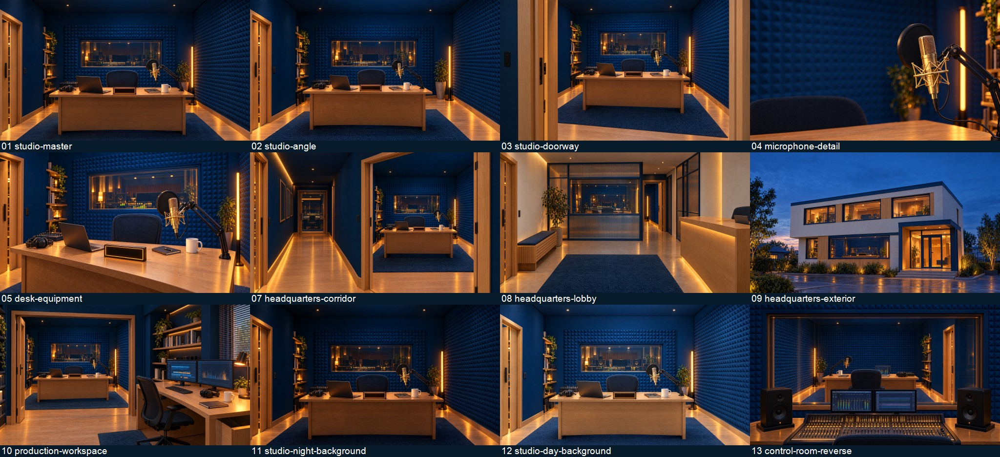

# AI通訳ラジオ｜本社・スタジオ素材ライブラリ

> **現行方針：外観09を採用、通路07は素材感のみ部分採用。** その他の旧画像・動画・3D試作は不採用を維持します。通路画像内の直通扉・斜め扉・ブース配置は引き継ぎません。本社全体の新しい図面は `experiments/headquarters-plan-20261001/README.md` を参照。ブース詳細はユーザー作成です。

> **履歴：一括不採用にした時点の記録（現行の例外は上記）。** このフォルダのスタジオ画像・動画・派生素材は番組へ採用しません。削除せず、配色や素材感の参考として保持します。以下の採用候補・使い方は過去の記録であり、新しい配置の根拠にはしません。新方針は `experiments/studio-spatial-foundation-20261001/README.md` を参照してください。

2026-09-30 JST。正式Webヒーローを参照した猫なしの素材集です。画像はGPT Image 2.5（Flare / max / 4K）、動画はMiniMax H3（2K / 10秒指定）。

## 以前の使用想定（参考記録）

- 完全な定点背景には4K静止画を使用してください。固定指定の動画にもカメラの動きが出ています。
- 動画を本編に重ねる際は silent/ の音声なし版を使用してください。元動画はこのフォルダ直下に保存しています。
- ロゴ、ON AIRの文字、猫は既存素材を後から合成する想定です。画像内のライトボックスとマグカップは空白です。
- 動画03は指定外の人物が出現したため採用対象外。動画19が修正版です。
- 画像06は逆方向からの見え方が誤っていたため非推奨。画像13を調整室の基準としてください。
- 本素材は生成画像・動画です。実際の編集可能な3Dシーンや、正確に測量した建物ではありません。画角間の細かな配置差があります。
- ループの継ぎ目、全時間のちらつきや微細な形状変化は未検証。無条件にループ可能とは扱わないでください。

## 画像一覧

| 番号 | 内容 | 元画像 |
| --- | --- | --- |
| 01 | スタジオ全景・基準 | [PNG](01-studio-master.png) |
| 02 | スタジオ全景・画角違い | [PNG](02-studio-angle.png) |
| 03 | スタジオ入口 | [PNG](03-studio-doorway.png) |
| 04 | 金色マイクの寄り | [PNG](04-microphone-detail.png) |
| 05 | 机上の機材 | [PNG](05-desk-equipment.png) |
| 06 | 調整室・修正前（非推奨） | [PNG](06-control-room.png) |
| 07 | 廊下 | [PNG](07-headquarters-corridor.png) |
| 08 | ロビー | [PNG](08-headquarters-lobby.png) |
| 09 | 本社外観 | [PNG](09-headquarters-exterior.png) |
| 10 | 制作デスク | [PNG](10-production-workspace.png) |
| 11 | 夜のスタジオ背景 | [PNG](11-studio-night-background.png) |
| 12 | 昼のスタジオ背景 | [PNG](12-studio-day-background.png) |
| 13 | 調整室・逆側からの修正版 | [PNG](13-control-room-reverse.png) |

## 動画一覧

当初は人物が出る03を除き、修正版19を採用候補としていました。現在は全19本不採用です。ファイル名の static / a は生成時の指定を表し、実際のカメラ固定を保証しません。

| 番号 | 内容 | 音声なし版 | 対応する元画像 |
| --- | --- | --- | --- |
| 01 | studio-master-static | [MP4](silent/01-studio-master-static.mp4) | 01 |
| 02 | studio-master-push | [MP4](silent/02-studio-master-push.mp4) | 01 |
| 04 | studio-angle-b | [MP4](silent/04-studio-angle-b.mp4) | 02 |
| 05 | studio-doorway-a | [MP4](silent/05-studio-doorway-a.mp4) | 03 |
| 06 | studio-doorway-b | [MP4](silent/06-studio-doorway-b.mp4) | 03 |
| 07 | microphone-detail-a | [MP4](silent/07-microphone-detail-a.mp4) | 04 |
| 08 | microphone-detail-b | [MP4](silent/08-microphone-detail-b.mp4) | 04 |
| 09 | desk-equipment-a | [MP4](silent/09-desk-equipment-a.mp4) | 05 |
| 10 | desk-equipment-b | [MP4](silent/10-desk-equipment-b.mp4) | 05 |
| 11 | control-room-reverse-a | [MP4](silent/11-control-room-reverse-a.mp4) | 13 |
| 12 | control-room-reverse-b | [MP4](silent/12-control-room-reverse-b.mp4) | 13 |
| 13 | headquarters-corridor-a | [MP4](silent/13-headquarters-corridor-a.mp4) | 07 |
| 14 | headquarters-corridor-b | [MP4](silent/14-headquarters-corridor-b.mp4) | 07 |
| 15 | headquarters-lobby-a | [MP4](silent/15-headquarters-lobby-a.mp4) | 08 |
| 16 | headquarters-lobby-b | [MP4](silent/16-headquarters-lobby-b.mp4) | 08 |
| 17 | headquarters-exterior-a | [MP4](silent/17-headquarters-exterior-a.mp4) | 09 |
| 18 | headquarters-exterior-b | [MP4](silent/18-headquarters-exterior-b.mp4) | 09 |
| 19 | studio-angle-repair | [MP4](silent/19-studio-angle-repair.mp4) | 02 |

## 生成・確認記録

- manifest.json: プロンプト、参照画像、生成ID、取得URL、採用除外理由、費用。
- verification.json: 実ファイルの解像度・長さと、静音版の音声トラック確認。
- previews/video-review-*.jpg: 各動画の1秒・5秒・9秒の比較。サンプル確認であり全フレーム検査ではありません。
- verify-assets.ps1: 同梱RemotionのFFmpegで静音版と比較画像を作成するスクリプト。

既存のWeb、正式ロゴ、猫動画、Remotion構成、Season 2 Openingは変更していません。

## 生成時の記録・費用（過去の候補数）

- 生成画像13枚（195クレジット）、採用候補12枚。画像06を除外。
- 生成動画19本（380クレジット）、採用候補18本。動画03を除外、19へ置換。
- 今回追加制作575クレジット。先行6本の試作60クレジットと合わせた累計635クレジット。取得時の残高265.94。
- 画像候補12枚は3840×2160。元動画19本は2560×1440・10.125秒。音声なし版19本に音声トラックがないことを確認。
- 全動画について1秒・5秒・9秒の比較フレームを確認。全フレーム再生のレビューとループ検証は未実施。
- 09の椅子付近の明るさ、14の照明など、固定指定でも明るさの変化がある素材が含まれます。完全定点や照明固定が必要なら元静止画を使ってください。

